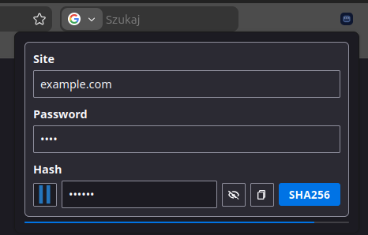

# Hash  Passwords

Firefox extension inspired by the [Stanford PwdHash](https://crypto.stanford.edu/pwdhash/).



While original pwdhash may be considered outdated and replaced by modern password managers there may be still few reasons to use it. 
Here few insights to get you inspired:

- it is pure drop-down popup; messing directly with password fields is error prone and fails off for multiple sites so copy-paste is solid option that works everywhere
- both master password and generated passwords are masked by default; no more accidental reveal
- there is no persistent storage, no one can steal and crack your password database
- pure local operation that works everytime and everywhere - plugin installed and master password in your head is all you need

## How it works

```text
                          ┌─────────────────┐
                          │ Master Password │
                          │  "supersecret"  │
                          └────────┬────────┘
                    ┌──────────────┼──────────────┐
                    ▼              ▼              ▼
            ┌──────────────┐ ┌──────────────┐ ┌──────────────┐
            │ example.org  │ │ somepage.com │ │ whatever.pl  │
            │              │ │              │ │              │
            │ Password:    │ │ Password:    │ │ Password:    │
            │ "XmQCE6V..." │ │ "pbAHFzn..." │ │ "IS6OTFz..." │
            └──────────────┘ └──────────────┘ └──────────────┘
```

Passwords are derived from your master password + domain. This is one-way derivation and cannot be reversed easily. One can guess your master password and try if it generates the same - this is hard, but not impossible.

Therefore remember:

**⚠️ Chain is as strong as the weakest link. Use strong master passwords. You only need to remember one so make sure it is a good one.**

## Disclaimer

This code is my personal project, use it at your own risk.

Main goals to develop it:

- prove that small, single purpose projects can nowadays be succesfully vibe coded
- teach me about browser extensions - how to write them and deploy, simple learn by doing

But if you find it useful - I'm very glad to hear it.
Bug reports, feature proposals and contributions are very welcome - pleare raise an issue describing it in details.

## What it includes

- A popup available directly from your toolbar
- Two hashing modes: legacy (MD5-based) and modern (PBKDF2-SHA256).
- Identicon for immediate feedback
- Passwords are cleared after domain is switched on tab and when timeout has passed (fixed to 1 minute).

## CLI tool

Browsers are mortal and so are plugins. Therefore in case you ever lose access to the plugin you can use the CLI tool to generate passwords. You can use it in other places - in case password is used in non-browser context.

Plugin is written in plain Go, famous for its long term compatibility and uses no extra dependencies to provide extra safety.

Basic usage:

```bash
go run cmd/hash-passwords --domain example.com --mode sha256

<type your password and close the stdin with Ctrl+D>
```

## License

- Project license: BSD 3-Clause (see `LICENSE`).
- Third-party/transitive notices for bundled dependencies: see `THIRD_PARTY_LICENSES.md`.
